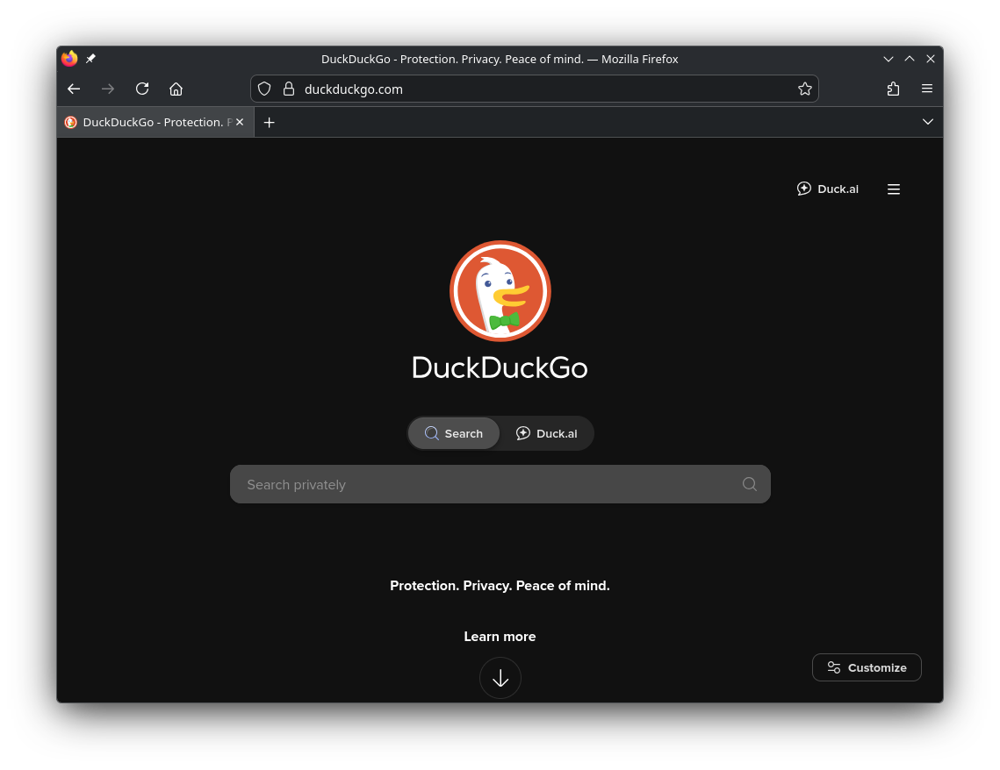

# Breezefox
a KDE styled Firefox userchrome

> [!WARNING]
> ### Disclaimer:
> This theme kinda sucks, I mainly just released this so it can be used as a reference by anyone better at making Firefox themes than me, expect many visual issues.

### Useful stuff

- **To use the KDE titlebar set this to 0** `browser.tabs.inTitlebar`.

- **If you're using the KDE global menu widget, you can enable firefox support set this to true** `widget.gtk.global-menu.enabled`.
	> **Note:** If you are using wayland, also enable `widget.gtk.global-menu.wayland.enabled`.

- **If you have `xdg-desktop-portal` & `xdg-desktop-portal-kde` installed you can set this to 1 to use the KDE file picker** `widget.use-xdg-desktop-portal.file-picker`.
